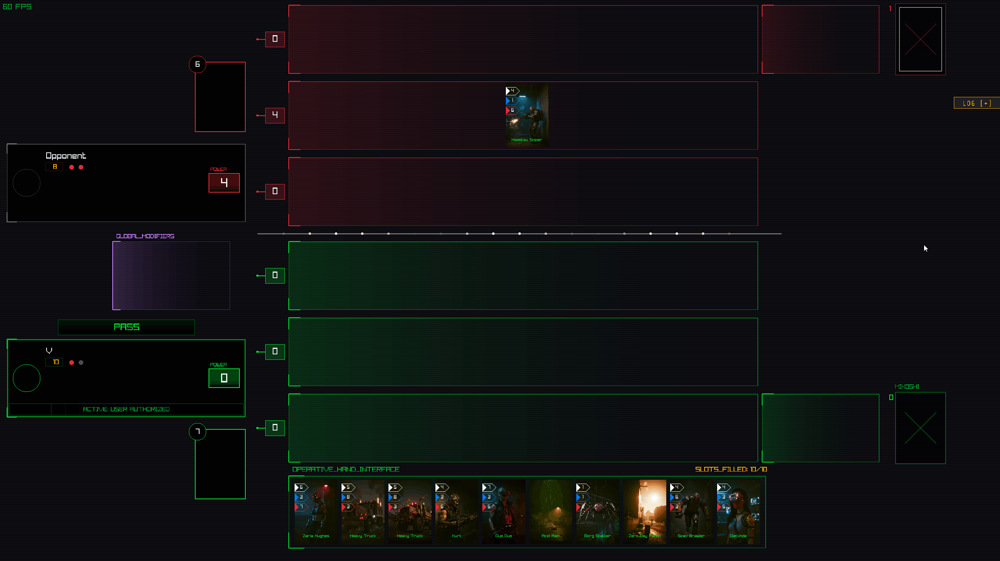
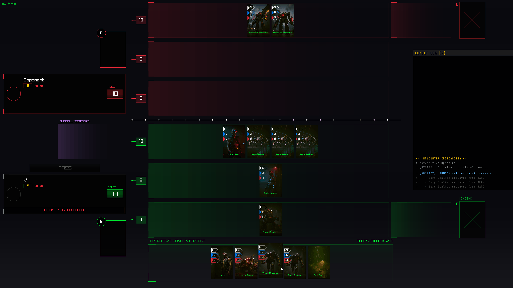
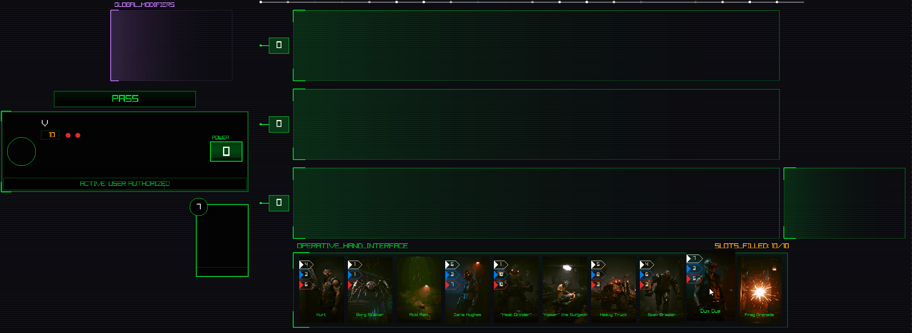
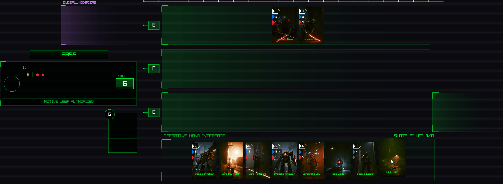
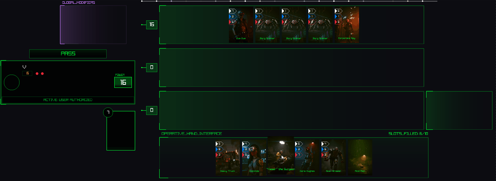

# PROJECT NULL: A Cyberpunk Card Sim
> **Internal Simulation v0.1-Alpha** > *Unauthorized Access Prohibited. Neural Link Required.*

`PROJECT NULL` is a high-performance, C++ card game built from the ground up using **raylib**. It serves as a technical proof-of-concept for a tactical, lane-based card game (heavily inspired by Gwent) set within the Night City universe.

---

## Gameplay Overview

### System Initialization & Faction Selection
This clip demonstrates the Finite State Machine (FSM) handling the transition from the boot sequence to faction selection and the transition into the main game loop.


### Core Game Flow & Logic
These clips demonstrate the underlying systems that govern the game's progression and ruleset.

| Round End & Passing | Match Resolution |
| :---: | :---: |
|  |  |
| *Showcases state handling for round transitions and score calculation.* | *Demonstrates win/loss condition detection and UI cleanup.* |

### New Mechanic: Firefight
To evolve the classic lane-based formula, I implemented the **Firefight** mechanic. This allows specific units to engage in direct combat across lanes, bypasssing standard turn-based constraints.

<p align="center">
  
  <br>
  <em>Direct unit-to-unit engagement logic implemented via a targeted action system.</em>
</p>

### Tactical Abilities & Environmental Effects
A showcase of the modular ability system. Each card effect is handled through a component-based architecture to allow for complex interactions:

| Summoning | Weather/Hazards | Buffs & Multipliers |
| :---: | :---: | :---: |
|  |  |  |

(! Please click to see in higher detail)

---

## 🛠️ Technical Stack
* **Language:** C++17
* **Library:** [raylib](https://www.raylib.com/)
* **Data:** SQLite3 (Persistent card data & progression)

### Key Engineering Features
* **Systems Architecture:** Custom State Engine and robust Game Loop managing complex turn-based logic.
* **Memory Management:** Modern C++ (RAII) principles using `std::unique_ptr` for leak-free resource handling.
* **UI/UX Framework:** Proprietary Widget System built from scratch for dynamic layouts and interactive board elements.
* **Data-Driven Design:** Decoupled ability system and SQLite integration allow for scalable content updates without code changes.
* **Asset Pipeline:** Integrated a local **ComfyUI (FLUX)** workflow for card art generation.

---

## Building from Source

### Prerequisites
* **CMake** (v3.15+)
* **C++17 Compiler** (MSVC 2019+, GCC 9+, or Clang)
* **OpenGL 3.3** drivers

### Build Instructions
```bash
# clone the repository
git clone [https://github.com/RuneBitDev/project_null.git](https://github.com/RuneBitDev/project_null.git)
cd ProjectNull

# configure the project
cmake -S . -B build -DCMAKE_BUILD_TYPE=Release

# build the executable
cmake --build build --config Release
```

---

## Motivation
This project explores low-level C++ game development and complex CCG logic. My goal was to recreate the "soul" of CDPR’s card design while maintaining a clean, optimized, and scalable codebase.

Note on Ai: This Project uses Ai for Image Generation. 
Whilst I am a firm believer that human artistry is irreplaceble (now even more so), I do belive that a developer should always remain at the frontier of technological shifts.
For Project Null, I utilized a local ComfyUI/FLUX workflow to generate UI assets and card art. 
This allowed me to maintain a rapid "iteration-to-implementation" pipeline, treating AI as a sophisticated tool for prototyping—much like a compiler or a debugger—to ensure the technical framework remained the priority
